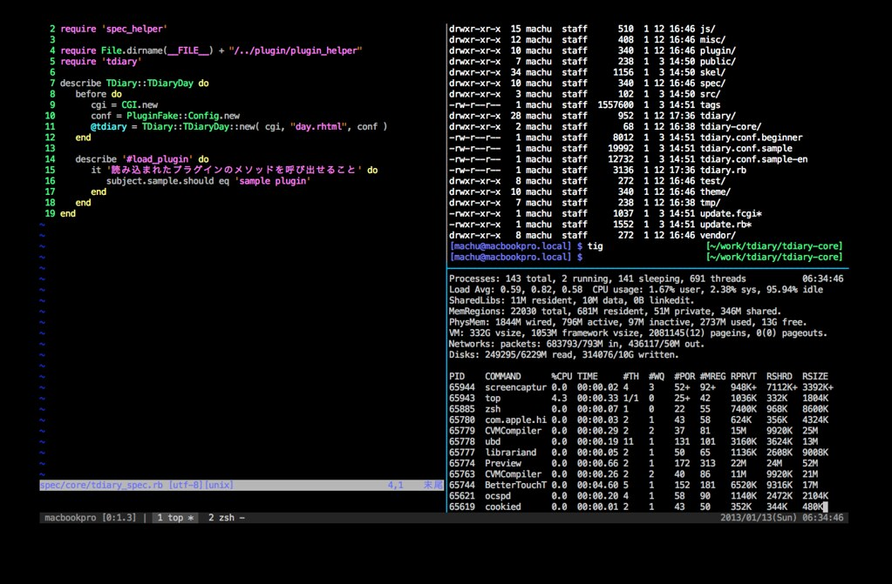

# Welcome

## Welcome to tmux!

If you are picking this book, you have probably heard about how tmux can increase one's programming or system administration workflow, watched a "hacking" video where hackers have many smaller "terminals" within their single terminal (this is what drew me to using tmux....), or you are just curious about what it is and what it can do.

In this book, I wanted to have **a simple, easy, jargon-free guide** to using tmux that is hands-on exercises that are easy to follow.

For the professionals who might find the read a bit slow, you can skip to the appendix where I have a quick reference guide to commands.

